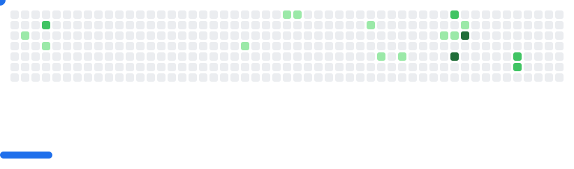

<h1 align="center">Hi 👋, I'm Harshal Sonawane</h1>
<h3 align="center">⚡ Full Stack Developer from India ⚡</h3>

  

  

---

## 🎮 Breakout – GitHub Contribution Game

  <picture>
    <source media="(prefers-color-scheme: dark)" srcset="images/breakout-dark.svg" />
    <source media="(prefers-color-scheme: light)" srcset="images/breakout-light.svg" />
    
  </picture>

---

## 🔗 Connect with Me

---

## 🛠️ Tech Stack

### 🚀 Frontend

  

### 🧩 Backend

  

### ☁️ Cloud & DevOps

  

### 🔧 Tools

  

---

## 📊 GitHub Stats

  
  

---

## 🚀 About Me

- 🔭 Currently working on **Full-stack apps & real-world projects**
- 🌱 Learning **DevOps, System Design, Microservices**
- 💡 Passionate about **clean UI + scalable backend**
- 💬 Ask me about **Next.js, JavaScript, Spring Boot, MongoDB**

---

  ⭐ If you like my work, feel free to star my repositories!

